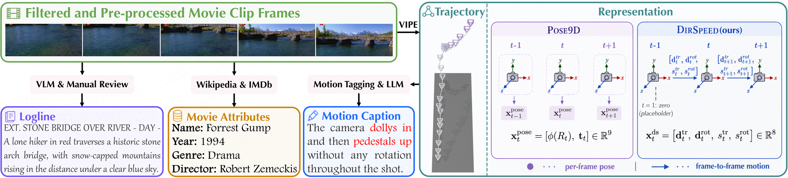
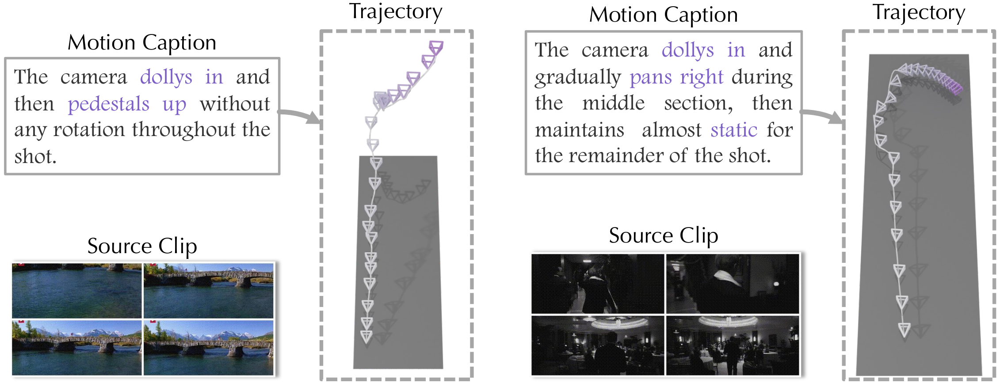
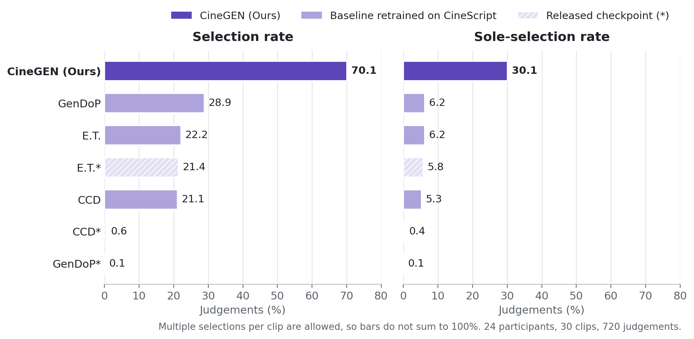

<div align="center">

# Unveiling the Value of Motion for Cinematic Camera Trajectories

🎉 **NeurIPS 2026** 🎉

[Ziqi Zhou](https://jia1018.github.io/)<sup>1</sup>, Yujian Yuan<sup>2</sup>, [Laura Sevilla-Lara](https://laurasevilla.me/)<sup>1</sup>

<sup>1</sup>University of Edinburgh &nbsp;&nbsp; <sup>2</sup>The Hong Kong University of Science and Technology

[](https://jia1018.github.io/CineGEN/)
[](https://arxiv.org/abs/2609.38683)
[](https://huggingface.co/Ziqi1018/CineGen-ckpts)
[](https://huggingface.co/datasets/Ziqi1018/CineScript-eval)

</div>

Cinematic camera motion is defined not only by *where* the camera is, but by *how* it moves. We show that
representing a camera trajectory by the **direction** and **speed** of its frame-to-frame motion
(**DirSpeed**), instead of per-frame poses, improves both trajectory–text alignment and text-to-trajectory
generation. This repo contains the **inference**, **evaluation**, and **visualization** code for
**CineGEN**, our masked autoregressive trajectory generator, trained on the **CineScript** dataset.

## 🎬 Representation and data



Each CineScript clip pairs a camera trajectory recovered by ViPE with a motion caption (motion tagging + LLM
rewriting), a screenplay-style scene **logline** (VLM + manual review) and, where the film can be identified,
**movie attributes** from Wikipedia/IMDb (left). Instead of per-frame poses (**Pose9D**), **DirSpeed** encodes each
step as a unit direction and a log-speed for translation and for rotation, an 8-D feature per frame (right).

## 🎯 Task

CineGEN maps a natural-language **motion caption** (verbs like *dollies in*, *pedestals up*, *pans right*),
together with a scene logline and the first camera pose, to a camera trajectory consistent with that motion.
Two examples:



## 👥 Human evaluation

We re-render [CameraBench](https://arxiv.org/abs/2504.15376) clips with [CameraAnything](https://arxiv.org/abs/2607.24591), a camera-conditioned video generator, keeping the scene, renderer settings
and seed fixed and swapping only the trajectory each method generated from the same motion caption. In a blinded
multi-selection study (24 participants, 720 judgements), CineGEN was selected as following the reference motion in
70.1% of judgements and was the only selection in 30.1%. Video examples are on the
[project page](https://jia1018.github.io/CineGEN/#rerender).



---

## 🚀 Pipeline at a glance

```bash
# 1. Clone + install
git clone https://github.com/Jia1018/CineGEN.git
cd CineGEN
pip install -r requirements.txt

# 2. Download checkpoints (~1.4GB) + eval data (~80MB) from HuggingFace Hub
./scripts/download.sh

# 3. Generate trajectories for the val split
python scripts/infer.py \
    --ckpt   checkpoints/cinegen/best.pt \
    --data_root data/cinescript-eval \
    --out_dir results/cinegen-generated

# 4. Run the evaluation
python evaluate/eval_attribute.py \
    --data_root data/cinescript-eval \
    --clf_dir   checkpoints/clf \
    --gen_dirs  results/cinegen-generated \
    --out_json  results/attribute_fidelity.json

python evaluate/eval.py \
    --data_root      data/cinescript-eval \
    --alignment_dsp  checkpoints/align_dirspd_motion/best.pt \
    --clatr_dsp      checkpoints/clatr_dirspd_motion/best.pt \
    --attr_json      results/attribute_fidelity.json \
    --gen_dirs       results/cinegen-generated \
    --out_csv        results/eval_results.csv \
    --out_latex      results/eval_results.tex

# 5. Render a single trajectory (requires Blender 3.6.5)
export BLENDER=/path/to/blender-3.6.5/blender
bash visualize/render_clip.sh <CLIP_ID> results/cinegen-generated results/renders
```

The rest of this README explains each step.

---

## 🛠️ 1. Installation

- Python 3.10+
- PyTorch 2.x with CUDA (any version compatible with your driver)
- Optional: Blender 3.6.5 for trajectory visualization

```bash
git clone https://github.com/Jia1018/CineGEN.git
cd CineGEN
pip install -r requirements.txt
```

---

## 📦 2. Download checkpoints + eval data

Both artifacts live on HuggingFace Hub.

| What | HF Hub repo | Size |
|---|---|---|
| Model + alignment + classifier checkpoints | [`Ziqi1018/CineGen-ckpts`](https://huggingface.co/Ziqi1018/CineGen-ckpts) | ~1.4GB |
| Eval data pack (val split: matrices, captions, loglines, labels) | [`Ziqi1018/CineScript-eval`](https://huggingface.co/datasets/Ziqi1018/CineScript-eval) | ~80MB |
| Train data pack (train split, same format; 23,207 clips) | [`Ziqi1018/CineScript-train`](https://huggingface.co/datasets/Ziqi1018/CineScript-train) | ~185MB |

```bash
./scripts/download.sh           # both
./scripts/download.sh --ckpts   # only checkpoints
./scripts/download.sh --data    # only eval data
./scripts/download.sh --train   # CineScript train split (not part of the default)
```

The download script uses `huggingface_hub.snapshot_download` and does not require an HF token for these public repos.

After running, your layout should be:

```
CineGEN/
├── checkpoints/
│   ├── cinegen/best.pt                 # 477MB — main model
│   ├── align_dirspd_motion/best.pt     # 514MB — alignment evaluator (F1/FCD/Cov/AlignScore)
│   ├── clatr_dirspd_motion/best.pt     # 194MB — independent CLaTr evaluator
│   └── clf/<setting>/...               # 178MB — movie-attribute probes (15 settings)
└── data/cinescript-eval/
    ├── index.jsonl                     # per-clip captions + loglines
    ├── matrices/<clip_id>.npz          # real 4×4 c2w GT
    ├── depth/<clip_id>.npy             # depth features (for attribute classifiers)
    ├── clip_movie_mapping.json         # raw labels for attribute eval
    └── held_out_splits.json            # classifier-side splits for clean attribute eval
```

---

## ✨ 3. Inference — generate trajectories

```bash
python scripts/infer.py \
    --ckpt        checkpoints/cinegen/best.pt \
    --data_root   data/cinescript-eval \
    --out_dir     results/cinegen-generated \
    --batch_size  32
```

For each val clip, this writes `<out_dir>/<clip_id>.npz` (containing the generated 4×4 c2w matrices) plus a `metadata.jsonl`. The script auto-detects the model config (no-AE / sep-encoded logline / first-pose / dirspd) from the checkpoint.

### Random-unmask ablation

The default sampler picks the next masked positions by lowest hidden-state variance (the variance-guided heuristic). The random-unmask ablation picks them uniformly:

```bash
python scripts/infer_random_mask.py \
    --ckpt      checkpoints/cinegen/best.pt \
    --data_root data/cinescript-eval \
    --out_dir   results/cinegen-randmask
```

---

## 📊 4. Evaluation

The evaluation produces **10 metric columns**:

| Group | Columns |
|---|---|
| Trajectory quality | F1, FCD, Cov |
| Text alignment | AlnScore, CLaTr, R@1, MedR |
| Attribute fidelity | Era, Genre, Dir |

Two scripts produce the table:

```bash
# Attribute fidelity (Era / Genre / Dir) — runs the movie-attribute probes (15 settings x DirSpeed/Pose9D)
python evaluate/eval_attribute.py \
    --data_root data/cinescript-eval \
    --clf_dir   checkpoints/clf \
    --gen_dirs  results/cinegen-generated \
    --out_json  results/attribute_fidelity.json

# Full evaluation (combines trajectory quality + text alignment + attribute columns)
python evaluate/eval.py \
    --data_root      data/cinescript-eval \
    --alignment_dsp  checkpoints/align_dirspd_motion/best.pt \
    --clatr_dsp      checkpoints/clatr_dirspd_motion/best.pt \
    --attr_json      results/attribute_fidelity.json \
    --gen_dirs       results/cinegen-generated \
    --out_csv        results/eval_results.csv \
    --out_latex      results/eval_results.tex
```

Add more `--gen_dirs` paths to evaluate multiple model variants side-by-side (e.g., the random-unmask ablation).

---

## 🎥 5. Visualization

Render a single trajectory to a transparent PNG using Blender 3.6.5.

```bash
# 1. Install Blender 3.6.5 (older versions may work but are untested)
# 2. Point BLENDER at the executable
export BLENDER=/path/to/blender-3.6.5/blender

# 3. Render one clip
bash visualize/render_clip.sh <CLIP_ID> results/cinegen-generated results/renders
```

The shell wrapper does two things:
1. `visualize/postprocess.py` reads the generated `<clip_id>.npz`, applies Gaussian smoothing on translation and log-map smoothing on rotation (controlled by `SIGMA` env var, default 3.0), and writes a JSON.
2. `visualize/blender_render.py` (invoked under Blender) reads the JSON and produces a transparent PNG of the camera trajectory.

Tune the smoothing with `SIGMA=<value> bash visualize/render_clip.sh ...` — large values remove per-frame jitter from autoregressive sampling.

---

## 📝 TODO

- [ ] Release **training code** (`scripts/train.py`, training-loss configs)
- [x] Release **training data**: [`CineScript-train`](https://huggingface.co/datasets/Ziqi1018/CineScript-train) (camera trajectories, motion captions, loglines, movie attributes)
- [ ] Release the **caption and logline extraction pipeline**

Coming soon...

---

## 📖 Citation

If you find this work useful, please cite:

```bibtex
@inproceedings{zhou2026unveiling,
  title     = {Unveiling the Value of Motion for Cinematic Camera Trajectories},
  author    = {Zhou, Ziqi and Yuan, Yujian and Sevilla-Lara, Laura},
  booktitle = {Advances in Neural Information Processing Systems (NeurIPS)},
  year      = {2026}
}
```

---

## 🙏 Acknowledgements

CineGEN builds on prior open-source work. We gratefully acknowledge the following projects and datasets:

- [GenDoP](https://github.com/3DTopia/GenDoP) — Blender rendering pipeline (we patched and adapted parts of it for our renderer).
- [E.T.](https://github.com/robincourant/the-exceptional-trajectories) — trajectory generation baselines.
- [PulpMotion](https://github.com/robincourant/pulp-motion) — MAR-style architecture inspiration.
- [ShotBench](https://huggingface.co/datasets/Vchitect/ShotBench) — shot-level benchmark data.
- [CineTechBench](https://huggingface.co/datasets/Xinran0906/CineTechBench) — cinematic technique benchmark.
- [VADB](https://huggingface.co/datasets/BestiVictoryLab/VADB) — video-aesthetic dataset.
- [MovieShots](https://movienet.github.io/projects/eccv20shot.html) — shot-type dataset.
- [CondensedMovies](https://github.com/m-bain/CondensedMovies) — condensed-movie clips.

---

## 📄 License

This project is released under [CC BY-NC 4.0](LICENSE) — research-only, non-commercial.
The included checkpoints and eval data on HuggingFace Hub are released under the same terms. Source datasets retain their own licenses; see individual links above.
